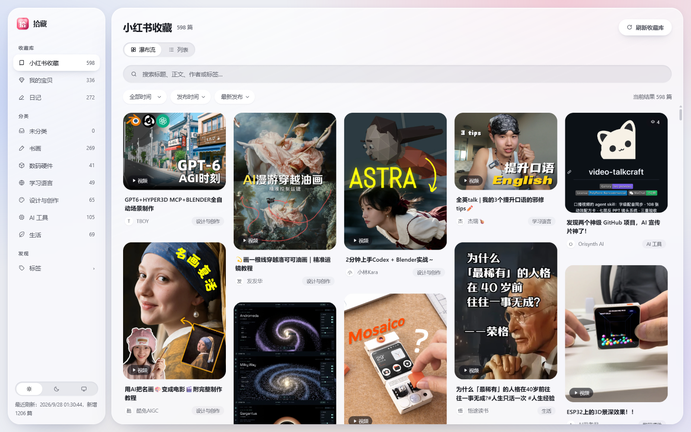

# 拾藏 Shícáng — 个人收藏库（Soft Glass 风格）

[GitHub 仓库](https://github.com/zaxchou/shicang)（版本管理）。把 Obsidian 库中的小红书收藏（Markdown + 本地图片 + 远程视频）变成一个可以 24 小时常驻访问的深色网页收藏库：浏览、搜索、按分类与时间筛选、阅读详情、播放视频、手动刷新新增内容、调整分类。**Obsidian 库只读**；所有展示端数据保存在本项目目录内。



深色主题与列表模式：`docs/screenshots/softglass-dark-masonry.png`、`softglass-light-table.png`、`softglass-dark-detail.png`

## 收藏库（三个来源）

拾藏管理三类内容，侧栏「收藏库」一键切换，每库独立分类、独立搜索与标签：

| 收藏库 | 来源（Obsidian） | 内容 | 展示 |
| --- | --- | --- | --- |
| 小红书收藏 | `RedNote/Bookmarks` | 606 篇小红书帖子收藏 | 瀑布流 + 列表 |
| 我的宝贝 | `我的收藏品` | 331 件个人藏品（有封面、价格、购买时间、朝代/作者/工艺等字段） | 瀑布流 + **列表（数据表，字段自动成列、可排序）** |
| 日记 | `flomo` | 268 条 flomo 闪念/日记（标题=日期+摘要，主题来自标签） | 瀑布流 + 列表 |

## 功能

- **收藏流浏览**：按发布时间从新到旧的无框瀑布流（缩略图 + 标题 + 作者 + 分类标签）；多图数量角标、视频标记。
- **分类导航**：小红书收藏 6 大类（书画 271 / AI 工具 106 / 设计与创作 69 / 生活 70 / 学习语言 49 / 数码硬件 41）；我的宝贝按「收藏分类」派生 8 类（茶器/拓片/书法/篆刻/文房/玉石/中国画/杂件）；日记按主题（画画/书法/日记…）。
- **列表（表格）模式**：每个收藏库可切换瀑布流 / 列表（切换会按模式重新取数：瀑布流分页、表格一次取全量）；表格列按数据自动生成——我的宝贝显示价格、购买时间、作者品牌、朝代、书风、装裱等（点击表头或回车排序，箭头与 `aria-sort` 同步），小红书收藏显示作者/分类/两种时间/标签，日记显示日期/主题/摘要。单库超过 1000 条时表尾会明确提示「只加载了前 1000 条、列排序仅作用于已加载部分」，不做静默截断。
- **每条一条备注**：详情头部一个「备注」按钮，点开才展开编辑区（⌘/Ctrl + Enter 保存，有改动显示「未保存」，有备注时按钮上有个小点），卡片底部显示两行截断的备注，并且**备注参与搜索**——搜自己写下的字就能翻回来。纯文本，最多 2000 字，只存在拾藏里。
- **列表模式下直接整理**：表格每行都有勾选框、星标按钮和归档按钮（不用进详情），备注单独一列；勾选多条后顶部出现批量条，一次归档/取回，且带「撤销」。表格是批量清理的主场。
- **标签目录**：侧栏「标签」进入全部标签页（小红书 891 个标签按热度排列，可搜索；全库去重 1059 个），点标签直达对应内容，可与搜索、时间筛选叠加。
- **搜索与筛选**：标题/正文/作者/标签全文搜索（多词 AND），时间范围（最近 7 天 / 30 天 / 自定义）、时间类型（发布时间 / 同步时间）、排序独立可配。
- **详情阅读**：居中弹层展示完整图文与视频；远程视频不可用时给出提示与原文入口；可在详情中修改主类（即时落盘，刷新不丢失）。
- **亮色 / 深色 / 跟随系统**：侧栏底部三档切换，跟随系统时实时响应系统外观变化，选择持久保存。
- **动效**：弹层开合、卡片入场、悬停缩放、图片淡入等克制过渡；尊重系统「减弱动态效果」设置。
- **语料导出（可索引的库）**：工具栏「导出语料」把全部笔记导成 `corpus.jsonl`（每行一篇：标题/作者/标签/分类/星标/状态/备注/时间/原文链接/源文件路径/**正文纯文本**/内容 hash）、`catalog.md`（按分类与标签的人读目录）与 `manifest.json`（内容源、三个 revision、篇数与构成）。**排除在"工作集"之外的记录也在里面**（已归档、源文件已移除）——要不要用交给消费方按 `status` / `sourceStatus` 判断。`contentHash` 只覆盖文本内容，归档一篇不会让外部 embedding 重算；内容没变时一个字节都不写。落在 `runtime/export/`（开发 `.local/export/`）：**不进 git、不进发布包、绝不写进 vault**（配错目录会拒绝写入）。刷新收藏库后自动更新；不经浏览器也可跑 CLI：开发机 `npm run export:corpus`，NAS **容器内**用 `node dist/scripts/export-corpus.js`（`tsx` 不在生产依赖里，`npm run export:corpus` 在容器内跑不了；宿主机直接跑则要先设 `NODE_ENV=production` + `DATA_DIR` + `SOURCE_ROOT`，否则会落回开发默认目录）。
- **识别图片文字（OCR，按需）**：详情头部一个「识别图片文字」按钮，把这一篇里的图片文字读成可检索的文本（原样转录，表格转 Markdown 表格）。**按需触发、不自动跑，且过程可见**：一篇最多一次识别 8 张（`AI_OCR_MAX_PER_NOTE`），**逐张请求**——面板显示「识别中 2/8…」与进度条、每张完成立即出现结果（一次点击最长可能 40-60 秒，没有进度就等于点了没反应），剩下的会明说"还有 N 张"；**结果按图片内容 hash 缓存**——同一张图在别的笔记里被引用时直接复用，识别错了可以「重来」。识别出来的文字放在详情正文里的一个**默认折叠**板块（每条带**缩略图**，一眼能看出对的是哪张图；折叠时渐隐 + 「展开全部（N 行）」，不用内滚动条），**能被搜索命中（与备注并列）、进 `corpus.jsonl` 的 `recognized`**，也能一键复制走。库里 53 篇正文为空、其中 49 篇文字全在图里——它们此前在搜索里等于不存在，这是这个功能的直接价值。图片由服务端自己从磁盘读并 base64，浏览器不上传文件。
- **语音转录（ASR，按需）**：flomo 的语音笔记在详情里点「转录语音」，服务端把 m4a 先用 **ffmpeg 转成 mp3**（网关只收 wav/mp3）再送 `mimo-v2.5-asr`（audio-only，**按音频秒数计费**）。同样是逐段请求 + 进度（「转录中 1/2…」），**按原始音频内容 hash 缓存**——同一段语音被多篇引用、或重开详情，都不会再花一次钱；单篇上限 4 段（`AI_ASR_MAX_PER_NOTE`，最长实测 9 分钟/段）。转录文本与图片 OCR 同板块展示（语音条目带 ♪ 标记与播放链接），**能被搜索命中、进 `corpus.jsonl` 的 `recognized`**，可复制、可「重来」。来源是 flomo 导出的 `flomo/attachments/…` 链接——v0.11.0 顺带修了这类链接从不登记媒体的解析缺口。
- **剪藏分组（大类 + 子库）**：侧栏第一项「**剪藏**」是个大类，点它 = 它下面全部子库的笔记一起看（搜索也跨子库），右边小箭头展开/收起子库。当前子库：**小红书**（原来的小红书收藏）、**网页**（浏览器插件剪藏，`Clippings` 目录，Obsidian Web Clipper 格式）、**微信公众号**（预留，等你给目录）。网页库**按来源网站自动分类**（哔哩哔哩 / 微信公众号 / 新浪博客……，新站点自动出现）；「我的宝贝」「日记」保持独立大类。分组的定义在 `config/app.json` 的 `groups`（纯视图层：改组名/换成员不会触发重建索引）。
- **网页剪藏（Obsidian Web Clipper）**：标题/作者/来源链接/发布时间/剪藏时间全部从 frontmatter 映射（作者 `[[wiki-link]]` 自动剥壳、每篇都有的样板标签 `clippings` 滤掉）；详情里「查看原文」直达来源链接；目录里没有 frontmatter 的手写笔记也收（标题用文件名、归未分类）。
- **剪藏封面与站内播放**：网页库的卡片有缩略图——**B 站剪藏按 BV 号调官方 API 取视频封面与时长**（右下角标 `h:mm:ss`），其它站点取正文首图（微信/新浪实测可用）。封面由服务端**按需抓取并缓存**在 `runtime/data/web-covers/`（只在公网 http(s) 上取、12s 超时、≤6MB、必须 image/*、失败 6 小时内不重试）。**拿不到图的卡片垫一块"站点瓷片"占位**（灰底 + 地球图标 + 站点名），缩略图位固定 4:3，所以抓取中的图和占位互相替换不会跳版。B 站剪藏的详情里点封面**就地展开官方播放器**（iframe 默认不加载，且只可能是 `player.bilibili.com`）。
- **手动刷新 + 自动分类**：点击「刷新收藏库」增量读取 Obsidian 中新增/变更的笔记（只解析新文件，秒级完成），并按沉淀的三层分类规则自动归类；规则未命中时可选调用 AI（MiMo/DeepSeek 等 OpenAI 兼容接口）兜底，单次刷新有调用上限（`AI_CLASSIFY_MAX_PER_REFRESH`，默认 40），人工在网页里改过的分类永远优先。不写入源目录。
- **标星与归档（人工标注层）**：卡片左上角（没有封面的卡片在作者行右端）和详情弹层里都能一键标星；详情里一个「归档」按钮把不再需要的收起来，侧栏「归档」里能找到并随时「取回」。**归档只有一个含义——现在对我来说没用了**，它只作用于拾藏：不删源文件、不动 Obsidian，也不用去小红书再点一次。归档视图会带上源文件已被移除的记录——标注是你自己的记录，不该因为文件被删就跟着消失。默认视图与侧栏计数都只算「在用」（含标星），数字与列表条数始终一致。标注存在 `runtime/data/annotations.json`，和分类覆盖一样属于「用户数据」——不进索引、不写回 Obsidian（连点不会冲突，单字段幂等写入；归档带 revision，冲突会提示）。
- **图片按文件头识别**：封面尺寸与类型不看扩展名——藏品库里有名为 `640` 的无扩展名图片（37 个），也有下载失败留下的错误响应体（3 个）；后者不会被当成封面。封面缺尺寸时才按 4:3 占位。
- **质感（Soft Glass）**：三层表面语法（浮起 / 平面 / 凹陷）+ 柔和光影代替描边，近白面板压在淡彩背景上，缓慢漂移的环境光透过玻璃；`backdrop-filter` 只用于四块大玻璃（侧栏 / 主面板 / 详情遮罩 / 详情面板），滚动 + 指针交互实测 0 掉帧（详见 `docs/design-language.md`）。

## 路线图（人工层、语料导出、图片 OCR **已完成**；语音转录**尚未实现**）

三组后续能力，完整方案（含实测依据与实施顺序）见 `plan.md` §18。共同前提：**索引是缓存，人工与 AI 产物是资产**——一律存 `runtime/` 数据目录，绝不写回 Obsidian 源笔记。

- **人工层**（**标星、归档、备注、表格标注列与批量归档全部完成**）：星标 / 归档（在用 ↔ 已归档）/ 每条一条备注，存 `runtime/data/annotations.json`（一个文件、一条 revision，字段级浅合并）。
- **可索引语料库**（**已完成**）：`runtime/export/` 下的 `corpus.jsonl` + `catalog.md` + `manifest.json`，见上面的功能说明；识别文本通过 `recognized` 字段一起交付。
- **AI 识别**：图片 OCR 与语音转录（**均已完成**，存 `runtime/data/media-text.json`，按媒体内容 hash 去重，同一段音频/同一张图被多篇引用只算一次）；语音经服务端 **ffmpeg 转 mp3** 后送 ASR（`input_audio.format` 只收 wav/mp3，源库全是 m4a）——**生产镜像因此装了 ffmpeg**（`apk add`，镜像约大 100MB）。同一条纪律：按需触发 + 单次上限 + 按内容 hash 缓存，**不在刷新管道里自动跑**。

AI 通道的能力边界（视觉直接接受 webp、ASR 必须 audio-only 的 `input_audio` 形态、**ASR 的 `format` 只收 wav/mp3**）已固化为可复跑脚本：`npm run probe:ai`（默认只用合成素材，不上传任何用户内容，共 6 项）。

## 快速开始（Windows 开发预览）

```powershell
# 1. 首次安装（需要 Node.js ≥ 22）
powershell -ExecutionPolicy Bypass -File scripts\setup.ps1
# 2. 启动（双击 start.cmd 亦可）
powershell -ExecutionPolicy Bypass -File scripts\start.ps1
```

浏览器打开 http://127.0.0.1:4317 。开发数据写入 `.local\data`，与生产隔离。

## 生产部署（群晖 Container Manager / Docker，已于 2026-09-27 实际部署验证）

目标形态：NAS（192.168.31.246）上以 Docker 常驻单实例，全家用浏览器访问 `http://192.168.31.246:4317`，电脑与 Obsidian 关闭不影响服务。**已部署并验证**：容器重启后分类与索引保留；NAS 路径与端口已核实（见 `deploy/.env.example` 注释）。

> **线上版本**：NAS 当前跑 v0.6.2；v0.7.0 起的标注层、语料导出、OCR 与四轮深审**已合入 main 但尚未部署**——按下方「日常更新」流程等明确命令再上线。

### 已核实的 NAS 环境参数

- v0.4.0 起 `SOURCE_ROOT` 指向 **vault 根**（`/volume2/Media/BaiduNetdiskWorkspace/mynote/mynote`），容器挂载到 `/source`，一次挂载覆盖三个收藏库。

- DSM 7.3.1，x86_64；docker 位于 `/usr/local/bin/`（SSH 非登录 shell 需手动加 PATH），docker 需要 root 权限（sudo）。
- 项目与源库都在共享盘：项目 `/volume2/Media/BaiduNetdiskWorkspace/myagent-work/zcode/MyInfobase`，源 `/volume2/Media/BaiduNetdiskWorkspace/mynote/mynote/RedNote`；Windows 的 Z: 直连该共享，**文件改动即时同步**，无需上传。
- 共享目录属主 uid=1026（zaxchou）/ gid=100（users），容器以该身份运行。

### 首次部署（已完成，留作记录）

1. NAS 上创建 `deploy/production/`：放入 `compose.yaml`（模板在 `deploy/compose.yaml`）与 `.env`（按 `.env.example` 填真实路径）。
2. 创建运行时目录 `runtime/data`、`runtime/backups`。
3. 打包发布：Windows 上 `powershell -File scripts\release.ps1 -Version <v>`（Dockerfile 会复制进发布包根）。
4. 构建并启动（NAS 上需 root）：
   ```sh
   sudo sh -c 'export PATH=/usr/local/bin:$PATH
   docker build -t myinfobase:<版本> <项目>/releases/<版本>
   docker compose -f <项目>/deploy/production/compose.yaml --env-file <项目>/deploy/production/.env up -d'
   ```
5. 首次启动自动全量扫描（当前 1205 篇：小红书 606 / 宝贝 331 / 日记 268）并从 `data-seed/categories-seed.json` 导入首批分类（仅未初始化的库导入，之后不再重复）。

### 日常更新（改完代码 → 上线，约 2 分钟）

```powershell
# Windows：打包新版本（release.ps1 会先跑 typecheck + 测试，不过就中止；确需跳过用 -SkipChecks）
powershell -File scripts\release.ps1 -Version <新版本>
# SSH 助手（scripts/nas-deploy.mjs，凭据走环境变量）一键更新：
$env:NAS_HOST='192.168.31.246'; $env:NAS_USER='zaxchou'; $env:NAS_PASS='<密码>'
node scripts\nas-deploy.mjs sudo-sh "sh /volume2/Media/BaiduNetdiskWorkspace/myagent-work/zcode/MyInfobase/deploy/nas-update.sh <新版本>"
```
`nas-update.sh` 会：构建新镜像 → 更新 `.env` 版本标签 → 重建容器 → 健康检查并校验版本一致。
镜像在 NAS 上构建（`deploy/Dockerfile` 里跑 `npm run build`），本地不需要先 build。
**镜像内容变化（v0.11.0）**：生产镜像 `apk add ffmpeg`（语音转录的 m4a 转码用），体积约 +100MB；
启动全量扫描时长不变。

### 回滚

```sh
sudo sh deploy/nas-rollback.sh <旧版本号>   # 镜像仍在本地，秒级切回
```

### 数据与备份

- 生产数据：`runtime/data/`（`overrides.json` 是人工分类、`annotations.json` 是标星/归档/备注，两者**不可重建**，请纳入 NAS 定期备份；`library-index.json` 可随时重建）。服务自动保留最近 5 份备份于 `runtime/backups/`。
- 语料导出：`runtime/export/` 是**派生产物**，随时可由索引+标注重建，所以不做备份轮换——重建比恢复便宜。`runtime/` 整体不进 git、不进发布包。
- 识别文本：`runtime/data/media-text.json` 在 `runtime/data/` 里，**和标注一样是资产**（重跑要花钱），请一并纳入备份。
- 源目录以只读方式挂载（`:ro`），应用无写入路径；导出目录若被误配到源目录内，`assertOutsideVault()` 会**拒绝写入**而不是照写。
- 更新仅重建容器，`runtime/` 不受影响；清理旧版本只允许作用于 `releases/` 与 `runtime/backups/`。

## 刷新规则

- 首次启动自动全量扫描；之后仅在你点击「刷新收藏库」时增量扫描（按 mtime + size 判断变更），新增笔记默认进入**未分类**。
- 重复刷新不会产生重复条目，也不会覆盖人工分类。源文件消失时标记为「暂不可用」，不删除记录与分类。
- 同步时间 ≠ 收藏时间：页面明示「发布 / 同步」两种时间，按发布时间排序，无效日期排在末尾。
- 刷新成功后会自动重导语料（内容没变则不写盘）；导出失败只记一条诊断，**不会让刷新失败**。设 `EXPORT_AFTER_REFRESH=false` 可关掉自动导出。

## 目录结构

```text
server/            Node.js + Express 服务端（reader 解析 / services 索引与分类 / routes API 与媒体）
src/               React + Vite 前端（双面板、瀑布流、详情弹层）
shared/            前后端共享类型与时间工具
config/app.json    内容源、端口等（环境变量优先级更高；日期计算固定 Asia/Shanghai，timezone 字段暂不生效）
public/            应用图标（favicon / apple-touch-icon / 侧栏品牌位，由 scripts/build-icons.mjs 生成）
data-seed/         首批分类 seed（仅在未初始化的库导入）
docs/              分类体系说明、验收记录、截图、设计参考
deploy/            Dockerfile、compose 模板、NAS 更新/回滚脚本
scripts/           安装/启动/发布/扫描 CLI、语料导出 CLI、AI 通道探测
.local/            开发数据与导出（不进生产）；runtime/ 生产数据与导出
releases/          版本化发布包
```

数据目录内部（开发 `.local/`、生产 `runtime/`）：

```text
data/              overrides.json（人工分类）/ annotations.json（标星·归档·备注）/ library-index.json（可重建）
backups/           数据文件的最近 5 份备份
export/            语料导出：corpus.jsonl / catalog.md / manifest.json（派生产物，可随时重建）
```

## git 推送凭据（本机，2026-09-28 查清）

推送 GitHub 时如果每次都弹登录，**先检查凭据存储有没有配**：

```bash
git config --global --get credential.credentialStore      # 空 = GCM 拿到令牌无处可存，所以每次都重新问
git config --global credential.credentialStore wincredman # 补上，然后完成一次授权即可
```

排查时踩过的两个坑，别再重复：

- **`cmdkey /list` 在 Git Bash 里要加 `MSYS_NO_PATHCONV=1`**——否则 `/list` 会被当成路径改写，命令直接报错退出，
  看起来像"凭据管理器里什么都没有"。
- **校验凭据要看 token 长度，不要看有没有输出**。`git credential fill` 在密码为空时同样会打印 `password=`，
  把 `password=` 之后整段屏蔽掉就会把"空"误读成"已拿到"：
  `printf 'protocol=https
host=github.com

' | git credential fill | awk -F= '/^password=/{print length(substr($0,10))}'`
- **本机 2026-09-28 起的做法：静态 PAT + 禁止交互**，这样推送永不弹窗、也永不等待：
  1. 在 GitHub 生成一条 fine-grained token（只需 `Contents: Read and write` 该仓库），存进凭据管理器（用户名写死）：
     `printf 'protocol=https
host=github.com
username=<账号>
password=<PAT>

' | git credential approve`
  2. remote 带上用户名，保证每次命中这条：`git remote set-url origin https://<账号>@github.com/<owner>/<repo>.git`
  3. `git config --global credential.interactive false` —— **静态令牌不需要刷新，所以 GCM 不再需要任何交互**。
  换 token（过期/撤销后）：重跑第 1 步即可，其余不动。
  注意：**token 只放在凭据管理器里**，不要写进仓库文件、脚本或文档。
- 为什么不能只靠第 3 步：`credential.interactive=false` 时 GCM 对**需要刷新的 OAuth 凭据**会干脆拒答
  （实测：允许交互 = 40 字符，禁止 = 0），只有静态 PAT 才两头都满足。
- **推送请走 `npm run push`**（= `scripts/git-push.mjs --tags`）：它带硬性超时（默认 240s），
  超时就放弃并报错，提交留在本地——这样即使凭据助手需要人工确认，**长时间无人值守的任务也不会被挂死**。
  仓库在网络盘上，打包本身就要几十秒到两分钟，不加超时会把"慢"误判成"卡住等你确认"。

## 故障排查

| 现象 | 处理 |
| --- | --- |
| 页面显示「无法连接收藏库服务」 | 服务未启动或端口不对；`curl http://127.0.0.1:<端口>/api/health` 检查 |
| 首页为空 | 点击「刷新收藏库」；仍为空检查 `SOURCE_ROOT` 是否指向 **vault 根**（其下应有 `RedNote/`、`我的收藏品/`、`flomo/`） |
| 图片不显示 | 多为媒体路径或挂载问题；确认 `Media/` 与笔记同源挂载，浏览器 DevTools 看 `/api/media/...` 响应 |
| 远程视频无法播放 | 平台防盗链或网络策略所致，详情页有提示与原文入口；本地图片不受影响 |
| 分类保存失败 | 多标签页并发冲突（409）时刷新页面重试即可；数据目录不可写时服务会拒绝写入并提示 |
| 分类数据异常 | 查看 `runtime/backups/` 最近备份；服务启动时会自动从最近可用备份恢复并记录诊断 |

## 开发

```bash
npm run typecheck   # 前后端 + 测试代码的类型检查
npm test            # vitest：解析/媒体路由/扫描完整性/分类优先级/幂等刷新/人工标注层/语料导出/OCR/语音转录/剪藏分组等 264 个用例
npm run build       # 构建服务端 + 前端到 dist/
npm run dev:server  # 服务端热重载（开发）
npm run dev:web     # Vite 前端开发服务器（代理 /api 到 4317）
npm run export:corpus  # 语料导出 CLI（不经浏览器；NAS 容器内请改用 node dist/scripts/export-corpus.js）
```

约定：源库（`Z:\...\mynote\mynote`）只读；所有写入收口在项目 `storage` 模块；分类、索引等数据通过 `DATA_DIR` 定位。分类体系与边界见 `docs/category-taxonomy.md`，设计语言见 `docs/design-language.md`，验收记录见 `docs/verification.md`。

### 改样式前先量一量

界面观感与帧耗都靠数字验收，不要凭感觉调。项目自带三个探针（不参与打包）：

```bash
cp scripts/probe-client.js dist/web/_probe.js      # 注入浏览器
# 控制台：await (0,eval)(await (await fetch('/_probe.js?v='+Date.now())).text())
#   __uiAudit()                      合成色 / 明度台阶 / WCAG 对比度（4 视图 × 2 主题应为零失败）
#   __uiBench(150,{mode:'both'})     滚动+指针帧耗（over32ms 必须为 0）
#   __uiLayout()                     越界与重叠检查
#   __uiSettle()                     等界面稳定（连续两次读数一致）后再取数

node scripts/pngview.cjs <png> 100 32              # 截图 → 亮度字符视图（看构图）
node scripts/scanline.cjs <png> <y> <x0> <x1> 2    # 明度扫描线（验证阴影/玻璃亮边）
npm run probe:ai                                   # AI 通道探测：/models + 视觉（合成图）+ ASR（合成音）+ 格式约束（m4a 必被拒 / mp3 必通过）
npm run probe:ai -- --image <本地图片>              # 追加一项：把指定本地图片（如库里的 webp）交给视觉模型转写
```

量之前先让界面静止：切主题会让所有颜色过渡几百毫秒，此刻 audit 会把合格界面判成对比度不合格。
可靠做法是 `localStorage.setItem('mb-theme','dark')` 后整页重载再量；同一主题内可先用 `__uiSettle()`。

`src/styles/app.css` 末尾的「性能预算」注释记录了每条硬性约束的实测数字（例如瀑布流条目的
`will-change: transform`：360 张卡片 23ms → 8ms/帧），改动前请先复测。
